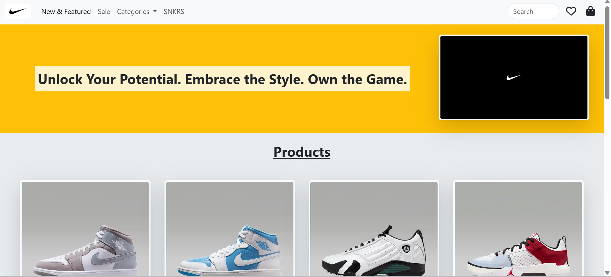

# 🏀 Nike Store Replica  

A **fully responsive** Nike Store replica built using **HTML, CSS, and Bootstrap**. This project mimics the **modern, sleek UI** of Nike’s official store, focusing on **clean layouts, interactive elements, and smooth responsiveness**.  

## 🚀 Features  

✅ **Hero Section:** High-impact visuals with a polished layout  
✅ **Product Grid:** Flexible and dynamic, built with Bootstrap’s grid system  
✅ **Hover Effects:** Engaging user interactions for a premium feel  
✅ **Fully Responsive Design:** Optimized for all screen sizes  
✅ **Navbar & Footer:** Sleek and intuitive navigation  

## 💡 Technologies Used  

- **HTML5** – Structuring the web pages  
- **CSS3** – Styling with flexbox & grid for a seamless UI  
- **Bootstrap 5** – Ensuring responsiveness and a modern look  

## 📸 Preview  

    

## 🛠️ How to Run  

1. **Clone the Repository:**  
   git clone https://github.com/ManvithaPola/Nikeproducts.git

2. **Navigate to the Project Folder:**  
   cd nike-store-clone

3. **Open `index.html` in your browser.**  

## 🔗 Live Demo  

https://nikeproduct-manvitha.netlify.app/

